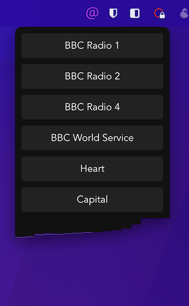

# webio

A simple tray radio app (with gimicy visualisation)

---

## Known bugs 

* often breaks when switching audio source due to bug in hls.
  - To fix, I will need to destroy() then rebuild the hls instance

---

Quickly Built using : 
* https://github.com/caoxiemeihao/electron-vue-vite
* https://github.com/element-plus/element-plus
* https://github.com/video-dev/hls.js/

Helpful tutorials:
* https://blog.logrocket.com/building-a-menu-bar-application-with-electron-and-react/
* https://www.patrick-wied.at/blog/how-to-create-audio-visualizations-with-javascript-html
